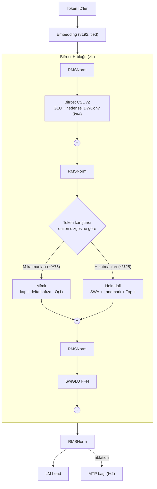
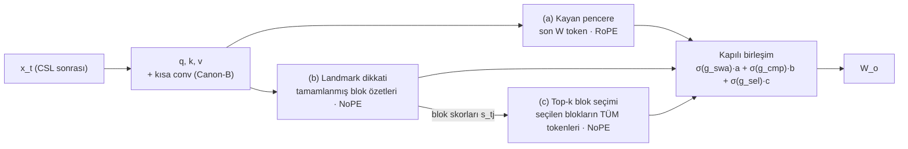

# 🌈 Bifrost-H — Ana Mimari ve Uygulama Planı

> **Sürüm:** v1 · 24 Eylül 2026 · **Durum:** PLAN (mimari kodu henüz yazılmadı; Faz 0 ile başlar)
> **Ad:** *H = Heimdall.* Bifrost köprüsünün bekçisi dokuz diyarı görür. Uzun bağlamda arama yapan katmanın adı da bu.
> **Bu belgedeki her sayı** ya bu oturumda ölçüldü (kaynağı yanında) ya da açıkça "hedef/tahmin" diye işaretlendi.

---

## 0. Tek sayfada özet

- **Teşhis.** Bifrost CSL (nedensel depthwise conv + SwiGLU) yerel sözdiziminde güçlü, ama **içeriğe göre adresleme yapamıyor.** Konvolüsyon girdiden bağımsız, sabit bir filtre. "Proje ID kaçtı?" sorusu ise bir **arama (retrieval)** problemi. Dilatasyonla receptive field'ı büyütmek bu sorunu çözmez (§3).
- **Çözüm: Bifrost-H, üç katmanlı bir hafıza hiyerarşisi.**
  1. **Bifrost CSL v2** her blokta: yerel sözdizimi ve örtük konum bilgisi sağlar. Cache'i O(1).
  2. **Mímir** katmanların ~%75'inde: V-PDM fikrinin **matematiksel olarak düzeltilmiş ve paralelleştirilmiş** hali (kapılı delta kuralı). Hafızası sabit boyutlu, O(1). Aynı anahtara yeni değer gelince **eskisini silip üzerine yazar.** Bu yüzden "proje id 1 → 2 → 3" sorusuna yapısı gereği **3** der. Bu oturumda doğrulandı: §3.
  3. **Heimdall (CSL-Attention)** katmanların ~%25'inde: kayan pencere + blok özetleri (landmark) + **top-k blok seçimiyle tam-token dikkat.** 1M bağlamda bile her token ~1-3K anahtara bakar ve iğneyi token hassasiyetinde bulur.
- **Cache.** CSL ve Mímir O(1). Heimdall'da pencere O(1), landmark'lar O(T/64). Tam KV O(T) ama yalnız Heimdall katmanlarında tutulur ve CPU RAM'e ya da NVMe'ye taşınabilir. ~115M ölçekte 1M token için tahmini bellek: Transformer ≈ **43 GB** KV, Bifrost-H ≈ **1.6 GB** (akış modunda ≈ **30 MB**). Hesap §5'te.
- **Eğitim hızı.** Token-token Python döngüleri yerine chunk-paralel matmul kullanılacak. Bu oturumdaki ölçüm: delta hafızada ileri+geri geçiş CPU'da **~40-50× hızlandı**. Buna Muon + WSD, bf16 + `torch.compile` ve dizi-uzunluğu müfredatı eklenecek.
- **Küçük veri ve reasoning.**
  - Canon tarzı conv (CSL zaten bu).
  - Sentetik bağlama ve değişken-takibi müfredatı.
  - Identifier yeniden-adlandırma artırması.
  - Ablation ile: MTP ve **Odin döngüsü** (yinelemeli derinlik).
- **Ölçüm disiplini.** Önce **Bifrost Bench** kurulacak. Her iddia seed'li, commit'e bağlı ve otomatik üretilmiş bir sonuca dayanacak. Eski turnuva ve rapor sayılarının çoğu kıyaslanabilir değil (§2), Faz 0 bu yüzden baştan baseline çıkarıyor.
- **Hedef.**
  - Aynı parametre ve aynı token bütçesinde **val loss'ta Transformer++ ile başa baş veya daha iyi.**
  - Uzun bağlam aramasında, çıkarım belleğinde ve hızında **açık ara önde.**
  - Bu tip hibritlerin (lineer/delta hafıza + az sayıda dikkat katmanı) büyük ölçekte işe yaradığı literatürde gösterildi: Gated DeltaNet-H, Qwen3-Next, Kimi Linear, NSA. Bizim işimiz bunu CSL tabanıyla, kendi ölçeğimizde **ölçerek** yeniden üretmek, sonra geçmek.

---

## 1. Hedefler ve başarı kapıları (sonuçlardan ÖNCE tanımlandı)

| Kapı | Ölçüt | Eşik | Nasıl ölçülür |
|---|---|---|---|
| **G0** Ölçüm altyapısı güvenilir | Testler + referans davranışlar | Nedensellik ve step≡forward testleri yeşil. Transformer++ ilk loss ≈ ln(8192) = 9.01. MQAR'da attention çözer, saf CSL çift sayısı arttıkça düşer (Zoology'nin nitel sonucu yeniden üretilir) | `tests/`, `bench/synthetic.py` |
| **G1** Arama | MQAR + KV-Overwrite (son değer) doğruluğu | Eğitim uzunluğunda ≥ %99, **8× uzunlukta ≥ %95** | `bench/synthetic.py` |
| **G2** Dil modelleme | Held-out val loss (nats/token + bits-per-byte) | 20M ve ~115M ölçekte aynı token bütçesiyle ≤ Transformer++ (+%1 tolerans). Pozisyona göre loss eğrisi eğitim uzunluğunun 4× ötesine kadar düşmeye devam eder | `bench/lm_eval.py` |
| **G3** Verim | Eğitim tok/s, çıkarım belleği, decode tok/s | GPU'da eğitim hızı Transformer++'ın ≥ 1.0×'i (T=2K) ve ≥ 1.5×'i (T=8K). 128K bağlamda çıkarım belleği ≤ 1/10. Decode hızı bağlam uzadıkça yaklaşık sabit | `bench/efficiency.py` |
| **G4** Akıl yürütme | Değişken takibi (1-8 adım), 2 adımlı arama, parity/S5 | Transformer++'dan kötü değil. Odin döngüsüyle **aynı FLOP'ta** anlamlı artış (3 seed, güven aralıkları ayrık) | `bench/synthetic.py` |

**Öldürme kriteri:** Bir bileşen, daha basit ablation'ını 3 seed'de geçemiyorsa mimariden çıkarılır. Karmaşıklık ancak ölçümle kazanılır.

---

## 2. Mevcut durum denetimi (bu oturumda doğrulandı)

Aşağıdakilerin hepsi kodla doğrulandı. Tekrar üretmek için:

```bash
python 08_BIFROST_H/tools/audit_causality.py
python 08_BIFROST_H/prototypes/mimir_proto.py
```

| # | Bulgu | Kanıt | Etkisi |
|---|---|---|---|
| 1 | Turnuvada A1/A2 (Plain/Diff Attention) sonuçları elle girilmiş ("prior run"). İlk loss'ları 4.12 / 3.42. Sıfırdan başlayan 8192 kelimelik bir modelde ≈ 9.01 olmalı. | `02_.../grand_architecture_tournament_9.py:635` | Baseline kıyası geçersiz |
| 2 | Turnuvadaki attention bloklarında **hiç konum kodlaması yok** (NoPE). CSL conv ise konum bilgisi veriyor. | `PlainAttnBlock` (:82), `DiffAttnBlock` (:110) | "DiffAttn + CSL kazandı" sonucu karışık: kazancın bir kısmı sadece konum bilgisinden gelebilir |
| 3 | 500 adım × 8 × 256 = ~1M token, tek seed. Skor olarak son 30 eğitim loss'unun ortalaması kullanılmış, validation seti yok. | `run()` | İstatistiksel olarak zayıf |
| 4 | **Gelecek sızıntısı:** `VectorizedRadarAttention` (max\|Δ\| = 6.2e-2) ve turnuvadaki **B3 SparseAdaptive** (3.6e-2) gelecekteki tokenleri görüyor. Radar'da iki sebep var: chunk'ın sorgu ortalaması gelecekteki sorguları içeriyor, ve erken chunk'larda top-k maskelenmiş (gelecek) chunk'ları seçebiliyor. | `tools/audit_causality.py` | Bu katmanlarla alınan loss'lar geçersiz |
| 5 | **CSL-QV5 kendi testini geçmiyor.** `step()` içinde depthwise conv'a `groups` verilmemiş, çalıştırınca RuntimeError. Tek satır düzeltmeyle nedensel çıkıyor ve step≡forward farkı < 1e-6. | `07_.../valerois_csl_qv5.py:267` | Cache yolu hiç çalışmamış, ama düzeltmesi kolay |
| 6 | V-PDM şablonunda üç sorun var: (a) tahmin **q** ile yapılıyor, delta kuralı **k** ister; (b) anahtar normalize edilmiyor, oysa LMS kararlılığı β‖k‖² < 2 ister; (c) her tokende Python döngüsü ve `.item()` senkronu var. | `06_.../v_pdm_starter_template.py:82, :98` | Fikir doğru, formül ve uygulama hatalı. Mímir bunları düzeltiyor |
| 7 | GLA, Matrix-SSD, Delta-CSL ve Resonant katmanları eğitimde token-token Python döngüsü kullanıyor. | `01_KATMANLAR_VE_MIMARILER/` | FINAL_REPORT'taki 470-3.640 tok/s mimarinin değil, uygulamanın ölçümü |
| 8 | "Gece laboratuvarı" benchmark'ı **modeli hiç çalıştırmıyor.** HumanEval değeri prompt'un derlenebilirliği × 0.9 (her koşuda %90). GSM8K=80, HellaSwag=78.5, WinoGrande=72 sabit yazılmış. | `02_.../run_overnight_lab.py:169-195` | FINAL_REPORT'taki "HumanEval %90" bir ölçüm değil |
| 9 | `train_csl_mi300x.py` hedefleri kaydırmıyor (`targets = input_ids.clone()`), yani model **mevcut** tokeni tahmin ediyor ve özdeşlik fonksiyonunu öğreniyor. NIAH sorgusunun cevabı da girdinin içinde. | `07_.../train_csl_mi300x.py:79, :183` | Bu motorla yapılan eğitim arama öğretmez |
| 10 | Üstel dilatasyonlu CSL'de dilatasyonu eğitim uzunluğunu aşan katmanlar (T=4096'da katman 12-15) ilk tap dışında yalnız sıfır dolguyu görüyor ve gradyan almıyor. "2M RF" teorik bir değer, etkin değil. Üstelik conv içeriğe göre seçim yapamıyor (§3). | `07_.../valerois_exponential_csl.py` | RF büyütme stratejisi değişmeli |
| 11 | Graft deneyinde (R1-Distill-1.5B → 28 katman GCAM) GSM8K %89.3 → %13.3, HumanEval %84.1 → %12, AIME %28.9 → %0 düştü. Rapor ise "korundu" diyor. | `05_.../official_r1_benchmark_showdown.md` | **Önemli gerçek bulgu:** bütün dikkat katmanlarını lineer hafızayla değiştirmek yeteneği yok ediyor. Hibrit + distilasyon gerekli (Faz 6) |
| 12 | 🔐 Canlı sitenin yönetici gizli anahtarı ve yedek parolası repoda açık yazılı. | `07_.../BIFROST_CSL_RESMI_KULLANIM_KILAVUZU.md` (§3 ve §8) | **Anahtarı sunucuda hemen değiştir.** Dosyadan silmek yetmez, git geçmişinde kalıyor; asıl çözüm anahtarı değiştirmek |

**İyi haberler:**
- CSL-QV5 temiz ve nedensel bir tasarım.
- GCAM-v2, C2, C3 ve B1 blokları nedensel.
- Muon implementasyonu hazır.
- Tokenizer sağlam: 8192 kelime, `<|thought|>` ve `<|tool|>` gibi özel tokenler dahil.
- En önemlisi: **V-PDM sezgin (sürprizi hafızaya yaz), literatürde büyük ölçekte işe yaradığı gösterilmiş kapılı delta kuralıyla aynı aile.** Yani doğru yöndesin; yalnız formülün düzeltilmesi ve paralel eğitilmesi gerekiyor.

---

## 3. Neden CSL tek başına bulamaz? "Proje ID 1-2-3" sorusunun cevabı

### 3.1 Konvolüsyon neden arama yapamaz?

CSL'nin çıktısı şöyle: $y_t = \sum_{j<K} w_j \odot x_{t-j\cdot d}$.

- Ağırlıklar $w_j$ **içerikten bağımsız.** Filtre, sabit uzaklıklardaki tokenleri karıştırır.
- "proje_id nerede atanmıştı?" sorusunun cevabı ise **içeriğe bağlı ve konumu bilinmeyen** bir adres.
- SiLU kapısı çarpımsal etkileşim ekliyor, ama bu yetmiyor. **Zoology** (Arora ve ark., 2023) şunu gösterdi:
  - Gated-conv modeller (H3, Hyena) ile attention arasındaki perplexity farkının **~%82'si ilişkisel hatırlamadan (AR)** geliyor.
  - AR'de **70M'lik bir attention modeli 1.4B'lik bir gated-conv modelini geçiyor.**
  - Gated-conv'un AR'yi çözmesi için model genişliğinin dizi uzunluğuyla birlikte büyümesi gerekiyor. Attention bunu sabit genişlikle çözüyor.
- Dilatasyonla RF büyütmek "görülebilen" alanı büyütür ama **seçme yeteneği vermez.** Ayrıca eğitim uzunluğunu aşan dilatasyonlar gradyan almaz (Bulgu 10).

### 3.2 "Proje ID 1-2-3: hangisini seçecek?" (bu oturumda ölçüldü)

Aynı normalize anahtara sırayla 1, 2, 3 değerleri yazıldı ve anahtarla sorgulandı (`prototypes/mimir_proto.py`):

| Hafıza türü | Güncelleme | Okunan değerin v1 / v2 / v3'e cosine benzerliği | Cevap |
|---|---|---|---|
| Toplamsal (GCAM-v2, GLA tarzı) | $S \mathrel{+}= k v^\top$ | **0.58 / 0.58 / 0.58** | Üçünün karışımı ❌ |
| **Delta kuralı (Mímir)** | $S \mathrel{+}= \beta\,(v - S^\top k)\,k^\top$ | **0.00 / 0.00 / 1.00** | **3** ✅ |

Farklı yaklaşımlar bu soruda nasıl davranıyor:
- **Sadece kayan pencere:** Atama pencerenin dışında kaldıysa bilgi kaybolur. Tek başına çözüm değil. Ama Heimdall'ın **bir kolu** olarak mantıklı: yerel tam-token hassasiyeti ucuz ve O(1) cache'li.
- **Mímir:** "Son değer" semantiği **yapısal.** Aynı anahtar gelince eski değer silinir.
- **Heimdall (softmax arama):** Üç atama da anahtarla eşit eşleştiği için dikkat üçe bölünür. Çözümü iki parça:
  - **Yakınlık eğilimi** (FoX tarzı unutma kapısı / mesafe cezası) yenisini öne çıkarır.
  - **Sorgunun içeriği** (ör. "*ilk* proje id?") sayesinde model, gerekirse ilk değeri de seçmeyi öğrenebilir.
- Üç modu (**son / ilk / kaç kez**) ayrı ayrı ölçen bir benchmark kuruyoruz: **KV-Overwrite** (§8).

---

## 4. Mimari: Bifrost-H

### 4.1 Genel yerleşim



- **Düzen dizgesi:** 12 katman için `"MMMH MMMH MMMH"`. Heimdall 4., 8. ve 12. katmanlarda.
- Ablation seçenekleri:
  - Oran: 3:1 / 5:1 / 7:1.
  - H katmanlarının konumu. Jet-Nemotron'a göre arama için kritik katmanların yeri göreve göre değişiyor.
  - Paralel füzyon: Mímir ve Heimdall aynı katmanda yan yana (Hymba tarzı).

### 4.2 Bifrost CSL v2 (yerel katman)

- **Yapı:** QV5'in `_local` bloğu.
  - $[u, g] = W_{in}\,\mathrm{RMSNorm}(x)$
  - $u \leftarrow \mathrm{DWConv}_k(u)$ (nedensel, k = 4-7)
  - $y = W_{out}(\mathrm{SiLU}(g) \odot u)$
- **Canon yerleşimi** (Allen-Zhu, *Physics of LMs 4.1*):
  - **A:** Token karıştırıcıdan önce. Bu, CSL v2'nin kendisi.
  - **B:** Mímir ve Heimdall içinde q/k/v üzerinde kısa conv (k = 4).
  - **C (opsiyonel):** FFN'den önce.
  - Bu kısa conv'ların sentetik akıl yürütme görevlerinde derinliği belirgin artırdığı ve NoPE/lineer modelleri güçlendirdiği gösterildi. Maliyetleri düşük.
- **Dilatasyon:** 2^l → 32768 çizelgesi kaldırılıyor. İstenirse küçük çok-ölçekli dilatasyon (1, 2, 4, 8) ablation olarak denenir.
- **Neden kalıyor:**
  - Yerel sözdizimini (girinti, parantez) ucuza çözüyor.
  - **Örtük göreli konum** sağlıyor. Böylece Mímir ve Heimdall'ın global kollarında RoPE'a gerek kalmıyor, bu da uzunluk genellemesine yardım ediyor.
- **Cache:** Katman başına (K−1)×D'lik halka tampon.
- **Açık soru (ölçülecek):** CSL v2 bloğun ~%25'i kadar parametre ekliyor. Param-eşli karşılaştırmada "sadece Canon-B" ile kıyaslanacak (E3.1).

### 4.3 Mímir: V-PDM v2 (kapılı delta hafıza)

$$
\begin{aligned}
q_t &= \mathrm{L2Norm}(\mathrm{ShortConv}(W_q x_t)),\quad k_t = \mathrm{L2Norm}(\mathrm{ShortConv}(W_k x_t)),\quad v_t = \mathrm{ShortConv}(W_v x_t)\\
\alpha_t &= \exp\!\big(-e^{A_h}\,\mathrm{softplus}(w_\alpha^\top x_t + b)\big)\in(0,1) &&\text{(unutma, kafa başına)}\\
\beta_t &= \sigma(w_\beta^\top x_t)\in(0,1) \quad [\text{ablation: } 2\sigma(\cdot)\in(0,2)] &&\text{(yazma gücü)}\\
\hat v_t &= \alpha_t\,S_{t-1}^\top k_t &&\text{1. tahmin et}\\
\delta_t &= v_t-\hat v_t &&\text{2. sürprizi bul}\\
S_t &= \alpha_t S_{t-1} + \beta_t\,k_t\,\delta_t^\top &&\text{3. sadece sürprizi yaz}\\
y_t &= W_o\big(\mathrm{RMSNorm}_{head}(S_t^\top q_t)\odot \mathrm{SiLU}(W_g x_t)\big) &&\text{4. oku ve kapıla}
\end{aligned}
$$

Bu, $S_t=\alpha_t(I-\beta_t k_t k_t^\top)S_{t-1}+\beta_t k_t v_t^\top$ ile aynı şey. Literatürdeki adı **Gated DeltaNet** (ICLR 2025). Qwen3-Next ve Kimi Linear bunun varyantlarını kullanıyor.

| | V-PDM şablonu | **Mímir** |
|---|---|---|
| Tahmin | $q\cdot S$ ❌ | $S^\top k$ ✅ (LMS / Widrow-Hoff) |
| Anahtar normu | Yok, kararsız olabilir | L2 norm, $\beta\in(0,1)$ ise kararlı |
| Eğitim | Token-token Python döngüsü + `.item()` | **Chunk-paralel** (WY/UT dönüşümü): chunk içinde matmul + `torch.linalg.solve_triangular`, chunk'lar arasında T/C adım |
| q/k/v kısa conv | Yok | Var (Canon-B) |
| Durum takibi | — | $\beta\in(0,2)$ ile negatif özdeğer seçeneği (parity/S5 için; Grazzi ve ark., ICLR 2025) |

**Bu oturumda prototip ölçümü** (`prototypes/mimir_proto.py`, CPU, fp32):
- Chunk-paralel ile token döngüsü arasındaki fark: ileride **4.8e-7**, gradyanlarda **≤ 1e-5**.
- İleri+geri süre (iki ayrı ölçüm): T=512'de ~1.2-2.0 s → 30-40 ms (**40-50×**), T=2048'de ~8.3-8.6 s → 157-180 ms (**48-52×**).

Diğer özellikler:
- **Karmaşıklık:** Eğitimde kafa başına O(T·C·d + T·d²). Çıkarımda token başına O(d²). Durum $H\times D_k\times D_v$ (6×128×128 fp32 ≈ 393 KB/katman).
- **Backend:** Saf PyTorch (CPU / ROCm / CUDA). CUDA'da flash-linear-attention Triton çekirdekleri opsiyonel. DirectML'de `solve_triangular` yoksa ileri-yerine-koyma döngüsüne düşülür.

### 4.4 Heimdall: CSL-Attention (seyrek, tam-token arama)



Sabitler: blok C = 64, pencere W = 256-512 (W ≥ C), seçim k = 4-16.

- **(a) Kayan pencere:** $(t-W, t]$ aralığında tam softmax, RoPE ile. Chunk'lı uygulanıyor (her blok kendine ve bir önceki bloğa bakar), karmaşıklık O(T·W).
- **(b) Landmark (sıkıştırılmış) kol:**
  - Her tamamlanmış blok $j$ için öğrenilen dikkat-havuzlama: $\ell^K_j=\sum_i \mathrm{softmax}_i(u_h^\top k_i)\,k_i$, $\ell^V_j$ de aynı şekilde.
  - Token skoru: $s_{t,j} = q_t^\top\ell^K_j/\sqrt d \;-\; \rho_h\log(1+b(t)-j)$, pencere dışındaki tamamlanmış bloklar üzerinde. İkinci terim öğrenilen yakınlık eğilimi.
  - $o_{cmp}=\sum_j \mathrm{softmax}(s)_j\,\ell^V_j$.
  - Bu, QV5'in `ChunkMemoryAttention`'ının geliştirilmiş hali: ortalama yerine öğrenilen havuzlama, yakınlık terimi ve pencereyle çift saymama.
- **(c) Seçim kolu:**
  - $\mathrm{Sel}_t=\mathrm{TopK}_j(s_{t,j})$, KV-grubu başına paylaşımlı.
  - Seçilen blokların **bütün tokenleri** üzerinde tam softmax, NoPE.
  - Opsiyonel FoX unutma kapısı: logit'e $F_t-F_s$ eklenir, $F=\sum\log f$.
- **Birleştirme:** Kafa başına sigmoid kapılar (NSA ve Gated Attention yaklaşımı).
- **Ablation seçenekleri:** Differential attention (a ve c kollarında; senin turnuva favorin, bu sefer adil kıyasla), QK-norm, GQA oranı.

**Nedensellik:** Seçim yalnız $q_t$'ye ve **tamamlanmış** bloklara dayanıyor. Radar'daki hata (chunk ortalamalı sorgu, maskelenmiş bloğun seçilebilmesi) burada yapısal olarak imkânsız. Birim testi zorunlu.

**Gradyan:** Top-k ayrık bir işlem. Landmark'lar (b) kolu üzerinden öğreniyor; seçim de aynı skorları kullandığı için tutarlı (NSA tasarımı).

**Token başına bakılan anahtar sayısı:**

| Bağlam | Heimdall: W + T/C + k·C | Tam dikkat |
|---|---|---|
| 4K | 512 + 64 + 1024 ≈ 1.6K | 4K |
| 128K | 512 + 2K + 1K ≈ 3.5K | 128K (~36× fazla) |
| 1M | 2 seviyeli landmark ile ≈ 512 + 256 + 64 + 1K ≈ 1.9K | 1M |

2 seviyeli landmark: 4096 tokenlik süper-bloklar önce seçilir, sonra onların içindeki bloklar.

**Uygulama (referans):** Top-k blok gather'ı 64-128'lik sorgu dilimleri halinde yapılır, bellek O(B·H·C_q·k·C·d). Hızlı yol seçeneği: "gecikmeli blok yönlendirme", yani seçim blok başında prefix'ten yapılır. Triton çekirdeği daha sonra.

> Dürüst not: Eğitimde landmark skorlaması O(T²/C). Bu chunk'lı bir karesel maliyet (CLAUDE.md kural 3'e uygun), T ≤ 32K için sorun değil. Çıkarımda token başına O(T/C), 2 seviyeyle daha da düşük.

### 4.5 Konum kodlama stratejisi

- **CSL conv** örtük göreli konum sağlıyor.
- **Mímir** zaten NoPE (sıralı yapı).
- **Heimdall (b) ve (c)** NoPE. Bu, 1M'e uzunluk genellemesi içindir; Kimi Linear ve Llama-4 iRoPE aynı yaklaşımı kullanıyor.
- Yalnız **(a) pencere** RoPE kullanıyor. Pencere kısa olduğu için hep eğitim dağılımının içinde kalıyor.
- Ablation: seçim kolunda RoPE vs NoPE, 8× ekstrapolasyon testiyle.

### 4.6 Başlangıç konfigürasyonları (ölçümle değişecek)

| Ad | d | L | Düzen | Mímir kafa × (Dk, Dv) | Heimdall q/kv kafa × dim | W / C / k | ~Param* | Donanım |
|---|---|---|---|---|---|---|---|---|
| **Nano** | 128 | 4 | `MMMH` | 2 × (64, 64) | 2 / 1 × 64 | 64 / 16 / 4 | ~2M | CPU, sentetik görevler |
| **Mini** | 320 | 12 | `(MMMH)×3` | 5 × (64, 64) | 5 / 1 × 64 | 256 / 64 / 8 | ~22M | CPU (duman) / GPU |
| **Small** | 512 | 16 | `(MMMH)×4` | 8 × (64, 64) | 8 / 2 × 64 | 512 / 64 / 8 | ~69M | RX 9070 XT |
| **Base** | 768 | 12 | `(MMMH)×3` | 6 × (128, 128) | 12 / 2 × 64 | 512 / 64 / 16 | ~115M | RX 9070 XT / MI300X |

\*Kaba hesap (tied embedding, SwiGLU 8/3·d). Kesin sayıyı kod basacak. Transformer++ baseline'ı katman sayısı veya FFN genişliği ayarlanarak **±%5** param-eşlenir.

---

## 5. Cache / durum tasarımı (çıkarım)

**Base (~115M)** için tahmini boyutlar (9 Mímir + 3 Heimdall, KV fp16, Mímir durumu fp32):

| Bileşen | Ne saklanır | Büyüme | 128K | 1M |
|---|---|---|---|---|
| CSL + kısa conv halka tamponu | Son K−1 girdi | O(1) | ≈ 0.2 MB | ≈ 0.2 MB |
| Mímir durumu | 9 × 6×128×128 | O(1) | 3.5 MB | 3.5 MB |
| Heimdall pencere halkası | 3 × W(512) × K,V × 2 kafa × 64 | O(1) | 0.8 MB | 0.8 MB |
| Landmark deposu | 3 × (T/64) × K,V × 2 × 64 | O(T/C) | 3 MB | 24 MB |
| Blok-KV (tam token) | 3 × T × K,V × 2 × 64 | O(T), **offload edilebilir** | 197 MB | 1.54 GB (int8: 0.77 GB) |
| **Bifrost-H toplam, tam mod** | | | **~205 MB** | **~1.57 GB** |
| **Bifrost-H toplam, akış modu** | Uzak blok-KV atılır | O(1) + O(T/C) | **~8 MB** | **~28 MB** |
| Transformer++ (~115M, 14L, MHA 768) | Her katmanda tüm K,V | O(T) | 5.6 GB | **43 GB** |

- **İki çıkarım modu:**
  - **Tam mod** (kayıpsız arama): Decode adımı başına Heimdall katmanı başına yalnız k·C tokenlik blok okunur. Bu yüzden blok-KV CPU pinned RAM'de ya da **NVMe'de** durabilir, seçilen bloklar önceden getirilir. `aero_nvme_byte_streamer` fikri burada gerçek bir işe yarıyor.
  - **Akış modu:** Belli bir ufkun ötesindeki tam blok-KV atılır. Landmark'lar ve Mímir kalır. Uzak tam-token hassasiyeti azalır, ama anahtar-değer bağlamaları Mímir'de yaşamaya devam eder.
- **API:**
  - `cache = model.new_cache(B, mode="exact"|"stream", offload="none"|"cpu"|"nvme")`
  - `logits, cache = model.prefill(ids, cache)` (chunk'lı)
  - `logits, cache = model.step(tok, cache)`
- **Zorunlu testler:**
  - step ≡ forward, tüm pozisyonlarda.
  - prefill (farklı chunk boyutlarında) ≡ forward.
  - Cache bayt muhasebesi, ölçülen bellek ile tablo tutarlı mı?

---

## 6. Eğitim hızı ve verim reçetesi

1. **Sıfır Python token döngüsü.** Her şey chunk-paralel matmul. Ölçülen ~40-50× kazanç (§4.3) bunun ana kaldıracı.
2. **Muon + AdamW.** 2D gizli matrisler Muon'a (Newton-Schulz, momentum 0.95, Nesterov); embedding, head, norm, conv, kapı ve skalerler AdamW'ye (β = 0.9/0.95, wd = 0.1). Mevcut `valerois_muon_rdna4.py` temel alınır. Moonlight çalışmasında AdamW'ye göre ~2× hesap verimliliği raporlandı; bizde E3.4 ile ölçülecek.
3. **WSD LR çizelgesi** (warmup %2 → sabit → son %20'de doğrusal düşüş). Koşu uzatılabilir, çok-epoch'lu küçük veriye uygun.
4. **Hassasiyet:** GPU'da bf16 autocast, Mímir durum birikimi fp32. ROCm/CUDA'da `torch.compile`, fused AdamW.
5. **Kararlılık:** Çıkış projeksiyonları sıfırdan başlatılır. Heimdall'da QK-norm. z-loss (1e-4) veya logit softcap. Grad clip 1.0.
6. **Uzunluk müfredatı:** 512 → 2K → 8K, pencere de kademeli büyür. Mímir chunk boyutu (32/64/128) ayarlanır.
7. **Veri hattı:** memmap, pinned memory, önden getirme. Belgeler `<eos>` ile paketlenir. **Sabit val bölümü:** dosyanın son %1'i, hiç eğitilmez.
8. **Her şey ölçülür:** tok/s, yaklaşık MFU, tepe bellek, profiler ile adım süresinin kırılımı.
9. **Sonra:** Mímir için Triton (fla) çekirdekleri ve fused CSL (conv + kapı) çekirdeği. Mevcut `triton_csl_fused.py` bir başlangıç.

---

## 7. Küçük veriyle genelleme ve akıl yürütme

Dürüst çerçeve: Mimari orta düzeyde kazanç sağlar. Küçük veride **en büyük kaldıraç veri tasarımı ve eğitim hedefleridir.**

1. **Canon/CSL katmanları** (zaten elimizde): akıl yürütme derinliği için.
2. **Sentetik müfredat.** Tokenlerin %5-15'i, anında üretilir ve sonsuzdur, bu yüzden ezberlenmez. Gerçek tokenizer ile, kod benzeri yüzey biçiminde yazılır:
   - KV-Overwrite (`proje_id = 7 … proje_id = 3 … print(proje_id)`)
   - MQAR
   - Değişken takibi (`a = 5; b = a; c = b; print(c)`)
   - Parantez/girinti eşleme
   - Karalama alanlı küçük aritmetik
   - Sıralama ve kopyalama
3. **Identifier yeniden-adlandırma artırması.** AST veya `tokenize` ile her dosyada değişken ve fonksiyon adları tutarlı biçimde rastgele değiştirilir. Model isim ezberi yerine **bağlam içi bağlamayı** öğrenmek zorunda kalır, veri de efektif olarak çoğalır. Proje-ID senaryosunu doğrudan destekler. Ölçülecek (E5.2).
4. **FIM (fill-in-the-middle):** Kod için %10-50 oranında, ablation.
5. **MTP:** Bir ek baş (t+2), ağırlığı 0.1-0.3. Bonus olarak self-speculative decoding ile çıkarımı hızlandırır. Uyarı: Gloeckle ve ark. (2024) küçük modellerde faydanın azaldığını raporladı, bu yüzden sadece ablation.
6. **Odin döngüsü (yinelemeli derinlik):**
   - Yapı: prelude (2 katman) → çekirdek (4 katman × r döngü; eğitimde r rastgele, girdi her döngüde yeniden enjekte edilir) → coda (2 katman).
   - Test anında daha zor problemler için daha fazla döngü çalıştırılır.
   - Senin V-Loop testin LM loss'u, NoPE attention ile ölçmüştü. Döngüler genelde perplexity'de değil **algoritmik görevlerde** kazandırır. Doğru metrikle ve FLOP-eşli olarak yeniden test edilecek (E5.4).
7. **Çok-epoch politikası:** ~4 epoch'a kadar tekrar, taze veri kadar iyi sayılır (Muennighoff ve ark., 2023). Val loss izlenir, wd 0.1.
8. **Sonra:** `<|thought|>` tokeni hazır, CoT SFT aşaması eklenebilir. `stream_thinker_100k.bin` (8.3M token) bunun için kullanılabilir.

---

## 8. Bifrost Bench: ölçüm altyapısı

### 8.1 Birim testler (her commit'te)
- Nedensellik: t0'dan sonrası rastgele değiştirilir, t0 öncesindeki çıktılar birebir aynı kalmalı.
- step ≡ forward ve prefill ≡ forward.
- Mímir chunk ≡ recurrent (ileri ve gradyan).
- Heimdall: seçimin gelecek bloğu asla seçmemesi.
- Cache bayt muhasebesi.
- fp32 ve bf16 dtype testleri.

### 8.2 Sentetik görevler (CPU'da dakikalar sürer)
| Görev | Ne ölçer | Izgara |
|---|---|---|
| **MQAR** (Zoology) | İlişkisel hatırlama | Çift sayısı 8-256, T = 64-1024 |
| **KV-Overwrite ("Proje-ID")** | Son / ilk / kaç kez semantiği | Atama sayısı 1-4, atama-sorgu mesafesi, **8× ekstrapolasyon** |
| **İğne / passkey** | Uzak tam-token arama | Derinlik × uzunluk ızgarası; 1K'da eğit → 64K'ya kadar test |
| **Değişken takibi** | Çok adımlı akıl yürütme | h = 1-8 adım + çeldiriciler |
| **Durum takibi** | Parity, S3/S5 permütasyon | β ∈ (0,1) ile (0,2) karşılaştırması |
| **Seçici kopyalama / indüksiyon** | Kopyalama ve indüksiyon kafaları | |

### 8.3 Dil modelleme
- Val loss (nats/token) ve **bits-per-byte** (tokenizer'dan bağımsız).
- **Pozisyona göre loss eğrisi.** Model bağlamı gerçekten kullanıyor mu? Loss uzak pozisyonlarda da düşmeye devam etmeli.
- Kod metrikleri: parantez ve girinti doğruluğu.
- Not: `stream_coder_100k.bin` kısa programlardan oluşuyor (LeetCode/Codeforces). Uzun bağlam kazancı bu verinin loss'unda görünmez. Uzun bağlam için **uzun dosyalar** (ör. Python stdlib ve site-packages modülleri) ve sentetik görevler kullanılacak.

### 8.4 Verim
- Eğitim tok/s ve tepe bellek.
- Bağlam 1K → 1M için decode tok/s ve cache baytı.

### 8.5 Protokol
- Param-eşleme ±%5, aynı token bütçesi, aynı veri sırası.
- Küçük ölçekte 3 seed.
- Mimari başına en az 3 LR'lık tarama.
- Sonuçlar JSON olarak yazılır, `RESULTS.md` otomatik üretilir (commit hash, config hash, seed ile). **Elle girilen sayı yok.**

### 8.6 Baseline'lar
- **B0 Transformer++:** RoPE + SwiGLU + RMSNorm, SDPA. Geçilmesi gereken çıta.
- **B1 CSL-QV5:** düzeltilmiş hali.
- **B2 Saf CSL:** üstel dilatasyonlu varyantıyla birlikte.
- **B3 SWA-Transformer:** W = 256.
- **B4 GCAM-v2:** nedensel blok.
- **B5 Mímir-only.**

---

## 9. Yol haritası

Bir "oturum" ≈ benim HIGH effort'ta bir çalışma bloğum (kod + test + deney). CPU deneyleri bu container'da ve senin laptopunda koşar; GPU deneylerini sen koşarsın.

### Faz 0: Hijyen + ölçüm altyapısı · 1-2 oturum · CPU
- [ ] 🔐 Anahtar ve parolayı değiştir (sen). Dosyadan kaldırma (ben, onayınla).
- [ ] `requirements.txt` düzeltmesi: `torch_directml` sadece Windows'ta. `numpy`, `tokenizers` eklenecek. `.gitignore` (`*.bin`, `*.pt`, `checkpoints*/`).
- [ ] `08_BIFROST_H/` paket iskeleti:
  - `data.py`: memmap + sabit val bölümü + paketleme
  - `train.py`: config'li, tek dosya
- [ ] Baseline'lar: Transformer++, QV5 (`groups` düzeltmesiyle), saf CSL.
- [ ] Testler: nedensellik, step ≡ forward.
- [ ] Bifrost Bench v0: MQAR, KV-Overwrite, iğne, değişken takibi, LM eval (pozisyona göre loss dahil).
- [ ] Geliştirme verisi:
  - Senin makinende: `stream_coder_100k.bin`.
  - Bulutta: Python stdlib + site-packages kodu, 8K tokenizer ile tokenize edilir (lisansı temiz; stdlib'den ölçülen ≈ 5.9M token, site-packages ile ~15-20M). Dosya adı `dev_code_8k.bin`.
- **Deneyler:**
  - **E0.1** Zoology yeniden üretimi (MQAR): Transformer++ çözmeli, saf CSL çift sayısı arttıkça düşmeli. Bu, ölçüm altyapısının doğrulaması.
  - **E0.2** LM yeniden-baseline, ~7M param: Transformer++ / QV5 / saf CSL / üstel CSL / GCAM-v2. CPU'da 5M tokenlik duman koşuları (≈ 15 dk/koşu), GPU'da tam koşu (3 seed).
- **Çıkış kapısı:** G0.

### Faz 1: Mímir · 1-2 oturum · CPU
- [ ] `recurrent_ref`, `chunk_parallel` (UT + `solve_triangular`, prototipi hazır), `step`. Kısa conv. β aralığı seçeneği.
- [ ] Testler: chunk ≡ recurrent (ileri + geri), step ≡ forward.
- **Deneyler:**
  - **E1.1** Hız: T = 256-8K aralığında tok/s.
  - **E1.2** KV-Overwrite: Mímir / GCAM-v2 / Transformer++ / SWA / CSL. *Hipotez:* Mímir "son değer"de ≥ %99 yapar; GCAM-v2 üst üste binme yüzünden düşer.
  - **E1.3** Parity/S5: β ∈ (0,1) ile (0,2).
- **Çıkış kapısı:** Eğitim uzunluğunda KV-Overwrite (son) ≥ %99.

### Faz 2: Heimdall · 2 oturum · CPU
- [ ] Kayan pencere (chunk'lı), landmark (öğrenilen havuzlama), top-k seçim (sorgu dilimli gather), kapılar, FoX ve Diff seçenekleri, cache.
- [ ] Testler: nedensellik (özellikle seçim yolu), step ≡ forward, seçim recall metriği.
- **Deneyler:**
  - **E2.1** Seçim recall'ı: iğnenin bloğu top-k'nın içinde mi? k, C ve T taranır.
  - **E2.2** Ekstrapolasyon: 1K'da eğit → 2K-64K'da test. NoPE vs RoPE, FoX açık/kapalı. KV-Overwrite'ın ilk/son/sayı modları.
- **Çıkış kapısı:** G1.

### Faz 3: Bifrost-H tam model + ablation · 2-3 oturum · CPU küçük + RX 9070 XT
- [ ] `model.py` (düzen dizgesi), MTP başı, Muon + WSD.
- **Deneyler:**
  - **E3.1** (Nano/Mini, CPU): düzen oranı 3:1 / 5:1 / 7:1, H konumları, paralel vs sıralı füzyon, CSL v2 var/yok (param-eşli), dilatasyon var/yok.
  - **E3.2** (Mini 20M, GPU, ~0.5B token): en iyi 3 konfigürasyon + Transformer++ + QV5, 3 seed.
  - **E3.3** (Small ~69M ve Base ~115M, GPU, 1-2B token): en iyi 1-2 konfigürasyon vs Transformer++.
  - **E3.4** Optimizasyon: Muon vs AdamW, MTP açık/kapalı, Diff vs gated attention.
- **Çıkış kapısı:** G2 ve G3'ün eğitim kısmı.

### Faz 4: Cache ve uzun bağlam · 2 oturum · GPU
- [ ] Birleşik cache (exact / stream), chunk'lı prefill, blok-KV offload (CPU pinned → NVMe), int8 KV, 2 seviyeli landmark.
- [ ] Uzun bağlam eğitimi: 2K → 8K → 32K müfredatı, %1-2 sentetik iğne karışımı.
- **Deneyler:**
  - **E4.1** Decode tok/s ve bellek, bağlam 1K → 1M, Transformer++ ile karşılaştırmalı.
  - **E4.2** 1M token akış demosu: 1M'de iğne ve KV-Overwrite.
- **Çıkış kapısı:** G3'ün çıkarım kısmı.

### Faz 5: Küçük veri + akıl yürütme · 2-3 oturum · GPU
- **E5.1** Sentetik müfredat oranı: %0 / 5 / 10 / 15.
- **E5.2** Identifier yeniden-adlandırma açık/kapalı (aynı token bütçesi). Ölçüm: val loss + doğal sözdizimli KV-Overwrite.
- **E5.3** FIM.
- **E5.4** Odin döngüsü (FLOP-eşli).
- **E5.5** Çok-epoch politikası.
- **Çıkış kapısı:** G4.

### Faz 6 (opsiyonel): Graft / distilasyon
- Hazır bir 1.5B modeli (Qwen2.5-Coder-1.5B veya R1-Distill-1.5B) Bifrost-H düzenine taşımak.
- Önem skoruna göre dikkat katmanlarının ~%25'i Heimdall olarak ağırlıklarıyla kalır. Geri kalanlar Mímir'e döner; q/k/v/o dikkat ağırlıklarından başlatılır.
- İki aşama: önce katman-çıktı hizalaması (MSE), sonra logit distilasyonu (KL).
- **Hedef:** Eski graft'taki kaybın (GSM8K %89 → %13) büyük kısmını geri kazanmak. Küçük veriyle güçlü bir modele en hızlı yol bu.

| Faz | Ana çıktı | Kapı | Donanım |
|---|---|---|---|
| 0 | Bench + dürüst baseline tablosu | G0 | CPU |
| 1 | Mímir | KV-Overwrite ≥ %99 | CPU |
| 2 | Heimdall | G1 | CPU |
| 3 | Bifrost-H + ablation | G2, G3 (eğitim) | CPU + RX 9070 XT |
| 4 | Cache + 1M | G3 (çıkarım) | RX 9070 XT / MI300X |
| 5 | Reasoning + küçük veri | G4 | RX 9070 XT |
| 6 | Graft (ops.) | — | RX 9070 XT / MI300X |

---

## 10. Donanım planı

| Ortam | Özellik | Kullanım |
|---|---|---|
| **Bulut container** (benim) | 4 çekirdek Xeon, 15 GB RAM, GPU yok, torch 2.14 CPU | Faz 0-2 kodu, testler, sentetik deneyler |
| **Laptop i5-13420H** | 4P + 4E çekirdek, 12 thread, AVX2 | Sentetik görevler, Nano/Mini duman testleri |
| **RX 9070 XT** | 16 GB, ROCm 7.2 | Faz 3-5'in ana ölçekleri |
| **MI300X** (erişim varsa) | 192 GB | Base/1B, uzun bağlam eğitimi, 1M demo |

- **Container'da ölçülen:** 7M paramlık QV5 ≈ **4.7K tok/s** (B=8, T=512, ileri + geri + AdamW). Aynı ölçekte Transformer ≈ 2.0K tok/s (CPU'da SDPA).
- **Laptop:** Bu container'ın tahminen 1.5-2× hızında. `torch.set_num_threads` için 4 / 6 / 8 / 12 değerleri kıyaslanmalı; E-çekirdekler senkronizasyonda yavaşlatabilir.
- **RX 9070 XT:** Linux önerilir. DirectML'de `solve_triangular` ve bazı SDPA yolları eksik olabilir.

---

## 11. Kod yapısı (hedef)

```
08_BIFROST_H/
├── PLAN_BIFROST_H.md          ← bu belge
├── README.md                  kullanım
├── bifrost/
│   ├── config.py              Nano / Mini / Small / Base dataclass'ları
│   ├── layers/
│   │   ├── norms.py           RMSNorm, QK-norm
│   │   ├── csl.py             Bifrost CSL v2 + ShortConv + halka tampon
│   │   ├── mimir.py           recurrent_ref · chunk_parallel · step
│   │   ├── heimdall.py        SWA + landmark + top-k + kapılar + cache
│   │   └── ffn.py             SwiGLU
│   ├── model.py               BifrostH LM (düzen dizgesi), prefill/step, MTP
│   ├── cache.py               halka tampon, landmark deposu, sayfalı blok-KV, offload
│   ├── baselines.py           Transformer++, CSL-QV5 (düzeltilmiş), saf CSL
│   ├── optim.py               Muon + AdamW grupları, WSD
│   └── data.py                memmap, val bölümü, paketleme, sentetik karışım, rename artırması
├── bench/
│   ├── synthetic.py           MQAR, KV-Overwrite, iğne, değişken takibi, parity/S5, kopyalama
│   ├── lm_eval.py             val loss, bpb, pozisyona göre loss
│   ├── efficiency.py          tok/s, bellek, decode-vs-bağlam
│   └── report.py              RESULTS.md üretimi
├── tests/                     nedensellik, step≡forward, chunk≡recurrent, seçim, cache
├── tools/audit_causality.py   (hazır) eski katmanların sızıntı denetimi
├── prototypes/mimir_proto.py  (hazır) chunk-paralel delta kuralı prototipi
├── train.py                   tek dosya eğitim (config + CLI)
├── configs/*.json
└── RESULTS.md                 yalnız otomatik üretilen sayılar
```

---

## 12. Riskler ve önlemler

| Risk | Olasılık | Önlem |
|---|---|---|
| Saf PyTorch chunk-delta GPU'da Triton çekirdeklerinden yavaş kalır | Orta | `torch.compile`, chunk boyutu ayarı, CUDA/ROCm'da fla çekirdekleri |
| Top-k gather'ın belleği veya süresi yüksek çıkar | Orta | Sorgu dilimli gather, gecikmeli blok yönlendirme hızlı yolu, sonra Triton |
| Küçük ölçek sonuçları büyüğe taşınmaz | Orta | İki ölçekte trend bakılır; yetenekler sentetik görevlerle ayrıca ölçülür |
| 25.6M token az, overfit olur | Yüksek | Çok-epoch izleme, lingua/thinker/fineweb verileri, sentetik müfredat, rename artırması |
| DirectML'de eksik op'lar | Yüksek | Linux + ROCm, fallback yolları |
| Karmaşıklık birikmesi | Orta | Öldürme kriteri + ablation disiplini (§1) |
| Hype'a kayma | — | Sadece otomatik `RESULTS.md`; her iddia bir koşu kimliğine bağlı |

---

## 13. Kapsam dışı (kapılar geçilene kadar)

BitNet / VQ4 kuantizasyon, MoE / 27B Triad, 7B graft (Faz 6 öncesi), `.vlkr` şifreli format, site ve yönetim paneli işleri. Hepsi değerli, ama önce çekirdeğin ölçülerek kanıtlanması gerekiyor.

---

## 14. Senden gerekenler

1. 🔐 Yönetici anahtarını ve parolayı **sunucuda değiştir.** Dosyadan kaldırmam için onay ver.
2. **Donanım:** RX 9070 XT'ye Linux + ROCm ile erişimin var mı? MI300X'e erişim ne zaman mümkün?
3. **Veri:** `stream_coder_100k.bin` (~51 MB) repoya mı gelsin (Git LFS), yoksa yerelde mi kalsın? Diğer bin'lerin (lingua, thinker, fineweb_edu_8k, master_code_8k) boyutları neler?
4. **Öncelik:** Varsayılan odak kod modeli (`stream_coder`). Farklıysa söyle.

---

## 15. Kaynaklar

- Arora ve ark., *Zoology: Measuring and Improving Recall in Efficient Language Models*, 2023 — arXiv:2312.04927
- Yang, Kautz, Hatamizadeh, *Gated Delta Networks: Improving Mamba2 with Delta Rule*, ICLR 2025 — arXiv:2412.06464
- Yang ve ark., *Parallelizing Linear Transformers with the Delta Rule over Sequence Length*, NeurIPS 2024 — arXiv:2406.06484
- DeepSeek-AI, *Native Sparse Attention*, 2025 — arXiv:2502.11089
- Lu ve ark., *MoBA: Mixture of Block Attention for Long-Context LLMs*, 2025 — arXiv:2502.13189
- Lin ve ark., *Forgetting Transformer: Softmax Attention with a Forget Gate*, ICLR 2025 — arXiv:2503.02130
- Qiu ve ark., *Gated Attention for Large Language Models*, 2025 — arXiv:2505.06708
- Ye ve ark., *Differential Transformer*, ICLR 2025 — arXiv:2410.05258
- Grazzi ve ark., *Unlocking State-Tracking in Linear RNNs Through Negative Eigenvalues*, ICLR 2025 — arXiv:2411.12537
- Behrouz ve ark., *Titans: Learning to Memorize at Test Time*, 2025 — arXiv:2501.00663
- Mohtashami & Jaggi, *Landmark Attention*, 2023 — arXiv:2305.16300
- Ren ve ark., *Samba: Simple Hybrid State Space Models for Efficient Unlimited Context*, 2024 — arXiv:2406.07522
- Allen-Zhu, *Physics of Language Models: Part 4.1 — Architecture Design and the Magic of Canon Layers*, 2025
- Moonshot AI, *Kimi Linear: An Expressive, Efficient Attention Architecture*, 2025
- Qwen Team, *Qwen3-Next* (Gated DeltaNet + Gated Attention hibrit), 2025
- NVIDIA, *Jet-Nemotron: Efficient Language Model with Post Neural Architecture Search*, 2025
- Geiping ve ark., *Scaling up Test-Time Compute with Latent Reasoning: A Recurrent Depth Approach*, 2025 — arXiv:2502.05171
- Liu ve ark., *Muon is Scalable for LLM Training* (Moonlight), 2025 — arXiv:2502.16982
- Gloeckle ve ark., *Better & Faster Large Language Models via Multi-token Prediction*, 2024 — arXiv:2404.19737
- Muennighoff ve ark., *Scaling Data-Constrained Language Models*, NeurIPS 2023 — arXiv:2305.16264
- Hsieh ve ark., *RULER: What's the Real Context Size of Your Long-Context LMs?*, 2024 — arXiv:2404.06654
